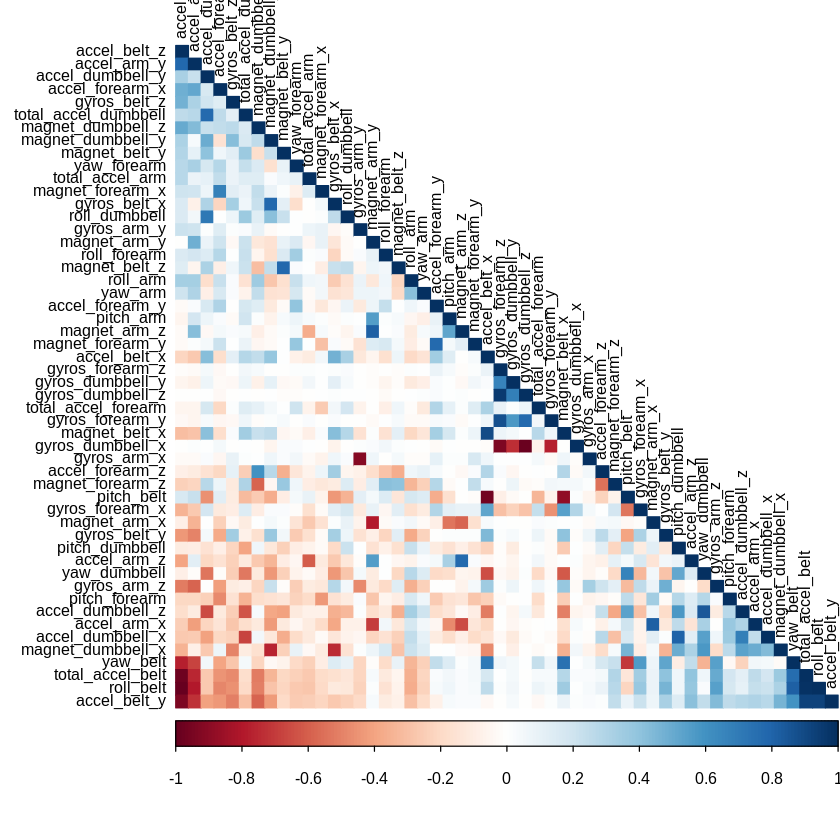
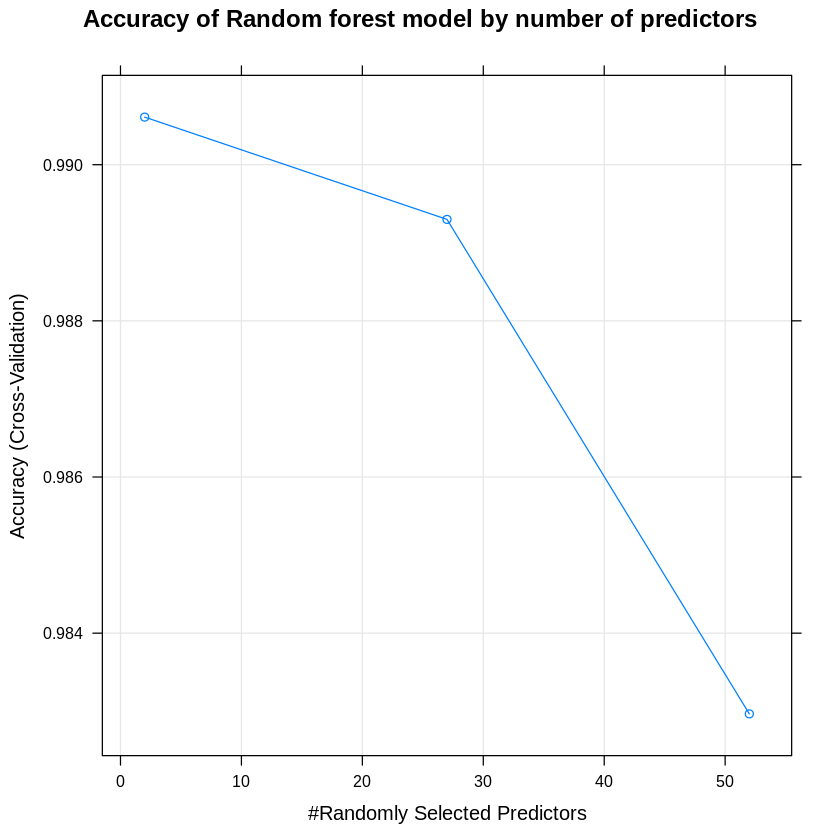
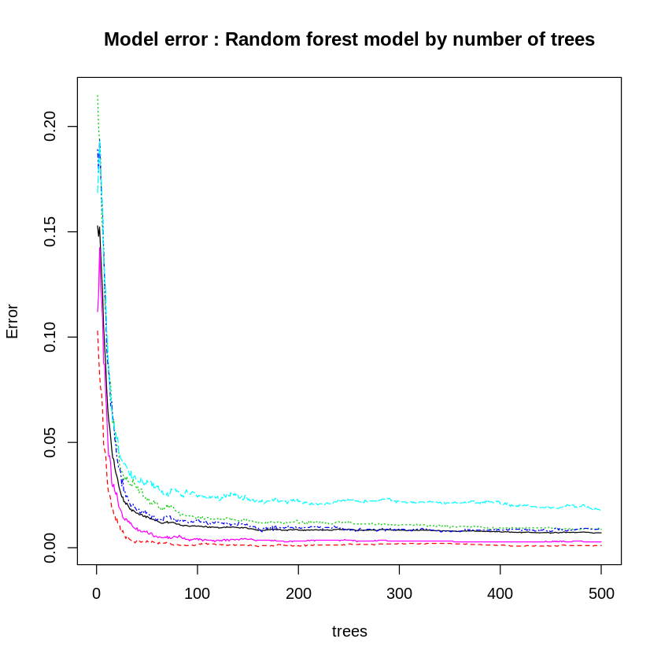
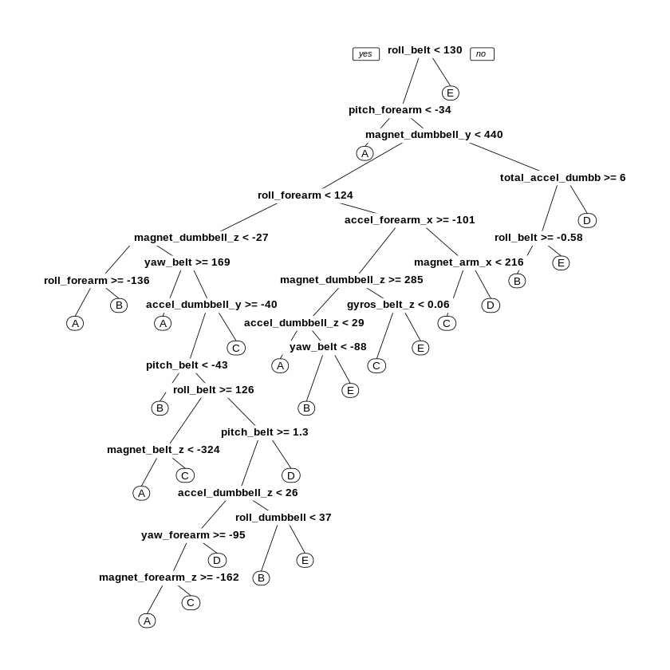

---
title: Practical Machine Learning Project Report

authors : Rohan

tags:
- Final Analysis
- Random Forests
- html Document attached

created_at : 2019-07-18
updated_at : 2019-07-29

tldr: This is short description of the content and findings of the post.
---


```R

```

## Introduction  

Using devices such as Jawbone Up, Nike FuelBand, and Fitbit is now possible to collect a large amount of data about personal activity relatively inexpensively. These type of devices are part of the quantified self movement – a group of enthusiasts who take measurements about themselves regularly to improve their health, to find patterns in their behavior, or because they are tech geeks. One thing that people regularly do is quantify how much of a particular activity they do, but they rarely quantify how well they do it.

In this project, we will be to use data from accelerometers on the belt, forearm, arm, and dumbell of 6 participant They were asked to perform barbell lifts correctly and incorrectly in 5 different ways. The five ways are exactly according to the specification (Class A), throwing the elbows to the front (Class B), lifting the dumbbell only halfway (Class C), lowering the dumbbell only halfway (Class D) and throwing the hips to the front (Class E). Only Class A corresponds to correct performance. The goal of this project is to predict the manner in which they did the exercise, i.e., Class A to E. More information is available from the website here: http://groupware.les.inf.puc-rio.br/har (see the section on the Weight Lifting Exercise Dataset).


## Data Preprocessing  

### Importing the Data

We first load the R packages needed for analysis and then download the training and testing data sets from the given URLs.


```R
# load the required packages
library(caret)
library(rattle)
library(rpart)
library(rpart.plot)
library(randomForest)
library(corrplot)
```


```R
# import the data from the URLs
trainurl <- "https://d396qusza40orc.cloudfront.net/predmachlearn/pml-training.csv"
testurl <- "https://d396qusza40orc.cloudfront.net/predmachlearn/pml-testing.csv"
```


```R

```

## Read the Data


```R
# loading data locally
pml_training <- read.csv("~/Desktop//pml-training.csv", na.strings = c("NA",""))
pml_testing <- read.csv("~/Desktop//pml-testing.csv", na.strings = c("NA",""))
```


```R
dim(pml_training)
```


<ol class=list-inline>
	<li>19622</li>
	<li>160</li>
</ol>


```R
dim(pml_testing)
```


<ol class=list-inline>
	<li>20</li>
	<li>160</li>
</ol>


The training dataset has 19622 observations and 160 variables, and the testing data set contains 20 observations and the same variables (160) as the training set. We are trying to predict the outcome of the variable "classe" in the training set.


```R

```

## Data cleaning

In this step, we will clean the data and get rid of observations with missing values as well as some meaningless variables.


```R
sum(complete.cases(pml_training))
```


406


We now delete columns (predictors) of the training set that contain any missing values.


```R
training <- pml_training[, colSums(is.na(pml_training)) == 0]
testing <- pml_testing[, colSums(is.na(pml_testing)) == 0]
```

Next, we get rid of some columns that do not contribute much to the accelerometer measurements.


```R
trainData <- training[, -c(1:7)]
testData <- testing[, -c(1:7)]
```


```R
dim(trainData)
```


<ol class=list-inline>
	<li>19622</li>
	<li>53</li>
</ol>


```R
dim(testData)
```


<ol class=list-inline>
	<li>20</li>
	<li>53</li>
</ol>


Now, the cleaned training data set contains 19622 observations and 53 variables, while the testing data set contains 20 observations and 53 variables. The "classe" variable is still in the cleaned training set.


```R

```

## Data spliting

In order to get out-of-sample errors, we split the cleaned training set trainData into a training set (train, 70%) for prediction and a validation set (valid 30%) to compute the out-of-sample errors.


```R
set.seed(250719) 
inTrain <- createDataPartition(trainData$classe, p = 0.7, list = FALSE)
train <- trainData[inTrain, ]
valid <- trainData[-inTrain, ]
```


```R

```

## Correlation Analysis

A correlation among variables is analysed before proceeding to the modeling procedures.


```R
corM <- cor(train[, -53])
corrplot(corM, order = "FPC", method = "color", type = "lower", tl.cex = 0.8, tl.col = rgb(0, 0, 0))
```





The highly correlated variables are shown in dark colors in the graph above. To make an evem more compact analysis, a PCA (Principal Components Analysis) could be performed as pre-processing step to the datasets. Nevertheless, as the correlations are quite few, this step will not be applied for this assignment.

To obtain the names of the variables we do the following

we use the findCorrelation function to search for highly correlated attributes with a cut off equal to 0.8


```R
high_Corr = findCorrelation(corM, cutoff=0.8)
```

We then obtain the names of highly correlated attributes


```R
names(train)[high_Corr]
```


<ol class=list-inline>
	<li>'accel_belt_z'</li>
	<li>'roll_belt'</li>
	<li>'accel_belt_y'</li>
	<li>'accel_dumbbell_z'</li>
	<li>'accel_belt_x'</li>
	<li>'pitch_belt'</li>
	<li>'accel_arm_x'</li>
	<li>'accel_dumbbell_x'</li>
	<li>'magnet_arm_y'</li>
	<li>'gyros_forearm_y'</li>
	<li>'gyros_dumbbell_x'</li>
	<li>'gyros_dumbbell_z'</li>
	<li>'gyros_arm_x'</li>
</ol>


```R

```

## Prediction Algorithm


We fit a predictive model for activity recognition using Random Forest algorithm because it automatically selects important variables and is robust to correlated covariates & outliers in general. We will use 5-fold cross validation when applying the algorithm.


```R
control <- trainControl(method = "cv", number = 5)
```


```R
fit_rf <- train(classe ~ ., data = train, method = "rf", trControl = control)
print(fit_rf, digits = 4)
```

    Random Forest 
    
    13737 samples
       52 predictor
        5 classes: 'A', 'B', 'C', 'D', 'E' 
    
    No pre-processing
    Resampling: Cross-Validated (5 fold) 
    Summary of sample sizes: 10990, 10989, 10990, 10989, 10990 
    Resampling results across tuning parameters:
    
      mtry  Accuracy  Kappa 
       2    0.9906    0.9881
      27    0.9893    0.9865
      52    0.9830    0.9784
    
    Accuracy was used to select the optimal model using the largest value.
    The final value used for the model was mtry = 2.


```R
plot(fit_rf,main="Accuracy of Random forest model by number of predictors")
```





```R

```

## Estimating Performance on Validation data set

Then, we estimate the performance of the model on the validation data set......


```R
# predict outcomes using valid set
pred_rf <- predict(fit_rf, valid)

# Prediction result
(conf_rf <- confusionMatrix(valid$classe, pred_rf))
```


    Confusion Matrix and Statistics
    
              Reference
    Prediction    A    B    C    D    E
             A 1674    0    0    0    0
             B    8 1128    3    0    0
             C    0   11 1012    3    0
             D    0    0   16  947    1
             E    0    0    0    0 1082
    
    Overall Statistics
                                              
                   Accuracy : 0.9929          
                     95% CI : (0.9904, 0.9949)
        No Information Rate : 0.2858          
        P-Value [Acc > NIR] : < 2.2e-16       
                                              
                      Kappa : 0.991           
                                              
     Mcnemar's Test P-Value : NA              
    
    Statistics by Class:
    
                         Class: A Class: B Class: C Class: D Class: E
    Sensitivity            0.9952   0.9903   0.9816   0.9968   0.9991
    Specificity            1.0000   0.9977   0.9971   0.9966   1.0000
    Pos Pred Value         1.0000   0.9903   0.9864   0.9824   1.0000
    Neg Pred Value         0.9981   0.9977   0.9961   0.9994   0.9998
    Prevalence             0.2858   0.1935   0.1752   0.1614   0.1840
    Detection Rate         0.2845   0.1917   0.1720   0.1609   0.1839
    Detection Prevalence   0.2845   0.1935   0.1743   0.1638   0.1839
    Balanced Accuracy      0.9976   0.9940   0.9893   0.9967   0.9995


```R
(accuracy <- conf_rf$overall[1])
```


<strong>Accuracy:</strong> 0.9928632115548


```R
(Out_sampl_err <- 1 - (accuracy <- conf_rf$overall[1]))
```


<strong>Accuracy:</strong> 0.00713678844519972


For this dataset, random forest method is way better than classification tree method. The accuracy rate is 0.993, and so the out-of-sample error rate is 0.007. This may be due to the fact that many predictors are highly correlated. Random forests chooses a subset of predictors at each split and decorrelate the trees. This leads to high accuracy, although this algorithm is sometimes difficult to interpret and computationally inefficient.


```R
plot(fit_rf$finalModel, main="Model error : Random forest model by number of trees")
```





```R

```

## Prediction on Testing data Set

We now use random forests to predict the outcome variable classe for the testing set.


```R
(predict(fit_rf, testData))
```


<ol class=list-inline>
	<li>B</li>
	<li>A</li>
	<li>B</li>
	<li>A</li>
	<li>A</li>
	<li>E</li>
	<li>D</li>
	<li>B</li>
	<li>A</li>
	<li>A</li>
	<li>B</li>
	<li>C</li>
	<li>B</li>
	<li>A</li>
	<li>E</li>
	<li>E</li>
	<li>A</li>
	<li>B</li>
	<li>B</li>
	<li>B</li>
</ol>

<details>
	<summary style=display:list-item;cursor:pointer>
		<strong>Levels</strong>:
	</summary>
	<ol class=list-inline>
		<li>'A'</li>
		<li>'B'</li>
		<li>'C'</li>
		<li>'D'</li>
		<li>'E'</li>
	</ol>
</details>


This shows that the random forest model is the best one.

### Decision Tree visualization


```R
treeModel <- rpart(classe ~ ., data=train, method="class")
prp(treeModel) 
```





```R

```
